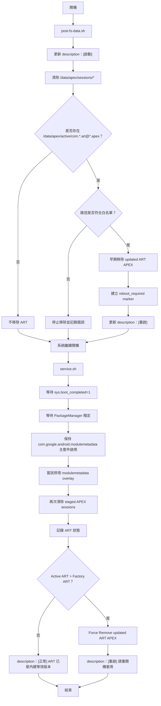

# Do Not ART Update

基於 [`dyrok/disable-gpsu-bootloops`](https://github.com/dyrok/disable-gpsu-bootloops) 修改的 Magisk / KernelSU / APatch 模組，用於降低 Google Play System Update（GPSU / Mainline APEX）自動更新 ART 導致 hook、Zygisk、Frida、runtime patch 失效的風險。

> ⚠️ 本模組屬於進階系統修改工具。請先確認你了解 APEX、ART、Magisk / KernelSU / APatch 模組開機流程。錯誤操作可能造成 bootloop。使用前建議備份資料，並確保具備 recovery / fastboot / factory image 救援能力。

---

## 目前設計重點

本模組已改為 **Force Remove 模式**，不再依賴 `pm rollback-app`。

核心策略：

```text
1. 開機早期清除 staged APEX sessions
2. 開機早期移除 /data/apex/active 內的 updated ART APEX
3. 不碰 com.google.android.modulemetadata 主套件
4. 只嘗試停用 modulemetadata overlay
5. 不使用 rollback-app
6. 不使用 uninstall-system-updates
7. 不直接刪 /system/apex
8. 不刪 /data/apex/decompressed
```

---

## 功能

本模組主要做以下幾件事：

1. **清除尚未套用的 staged APEX sessions**

   ```text
   /data/apex/sessions/*
   ```

2. **開機早期移除 updated ART active APEX**

   僅允許移除：

   ```text
   /data/apex/active/com.android.art@*.apex
   /data/apex/active/com.google.android.art@*.apex
   ```

3. **偵測目前 ART 狀態**

   - Active ART versionCode
   - Factory ART versionCode
   - Active ART path
   - Factory ART path

4. **支援 Google ART compressed / decompressed 狀態**

   例如三星裝置可能出現：

   ```text
   /system/apex/com.google.android.art_compressed.apex
   /data/apex/decompressed/com.android.art@331813010.decompressed.apex
   ```

5. **僅停用 Google Play System Update 的 overlay metadata**

   ```text
   com.google.android.overlay.modules.modulemetadata.forframework
   ```

6. **保留並啟用主 metadata package**

   ```text
   com.google.android.modulemetadata
   ```

   這個主套件不要停用或 uninstall，否則部分 ROM 可能造成 `system_server` bootloop。

7. **提供安裝時與 action.sh 即時 ART 檢查**

   - `customize.sh`：安裝時檢查 ART 狀態
   - `action.sh`：在 Magisk / KernelSU / APatch 的動作按鈕或手動執行時檢查 ART 狀態

8. **以中文 `[狀態]` 格式更新 module.prop description**

   例如：

   ```text
   [正常] ART 已是內建等效版本。Active=331813010 Factory=331813010。
   [重啟] 已移除新版 ART，請重開機套用。Active=361501120 Factory=331813010。
   [略過] 未找到 Google ART APEX。Android 11 或更舊版本通常不需要處理 ART 遠端更新。
   ```

---

## 不做的事

本模組**不會**做以下操作：

- 不停用 Play Store 的 Google Play 系統更新 UI。
- 不停用 `com.google.android.modulemetadata` 主套件。
- 不 uninstall `com.google.android.modulemetadata` 主套件。
- 不使用 `pm rollback-app`。
- 不使用 `pm uninstall-system-updates`。
- 不刪除 `/system/apex/*`。
- 不刪除 `/apex/*`。
- 不刪除 `/data/apex/decompressed/*`。
- 預設不自動重開機。
- 不保證所有 Android 版本與 ROM 都能 100% 阻止或回退 ART 更新。

---

## 為什麼不再使用 rollback-app？

早期版本曾嘗試使用：

```sh
pm rollback-app com.google.android.art
```

但實測部分裝置可能出現：

```text
APEX activation failed.
Reason: Session reverted due to crashing native process: zygote
```

這代表 ART rollback 嘗試套用時可能導致 zygote crash，系統又自動 revert 回新版 ART。

因此新版模組改用更直接的方式：

```text
直接移除 /data/apex/active 裡的 updated ART APEX
```

但為了降低風險，模組只允許移除明確符合以下白名單的路徑：

```text
/data/apex/active/com.android.art@*.apex
/data/apex/active/com.google.android.art@*.apex
```

---

## 為什麼不使用 uninstall-system-updates？

部分 Android 版本 / ROM 對 ART APEX 執行以下指令時會出現 PackageManager 例外：

```sh
pm uninstall-system-updates com.android.art
pm uninstall-system-updates com.google.android.art
cmd package uninstall-system-updates com.android.art
cmd package uninstall-system-updates com.google.android.art
```

可能錯誤：

```text
java.lang.NullPointerException:
Attempt to invoke virtual method
'boolean android.content.pm.ApplicationInfo.isUpdatedSystemApp()'
on a null object reference
```

因此本模組不使用 `uninstall-system-updates`。

---

## 為什麼不能 uninstall com.google.android.modulemetadata？

實測部分 ROM 若執行：

```sh
pm uninstall -k --user 0 com.google.android.modulemetadata
```

可能造成 `system_server` 開機階段崩潰，錯誤類似：

```text
java.lang.IllegalStateException:
Call to getInstalledModules before metadata loaded
```

因此新版模組只做：

```text
保持 com.google.android.modulemetadata 主套件存在並啟用
只嘗試停用 com.google.android.overlay.modules.modulemetadata.forframework
```

---

## 支援狀況

| 狀況 | 結果 |
|---|---|
| 尚未更新 ART | 記錄 ART 狀態，不移除 |
| 已下載但尚未重開套用的 APEX 更新 | 清除 `/data/apex/sessions/*` |
| ART 已更新到 `/data/apex/active/com.android.art@*.apex` | 開機早期移除 updated ART APEX |
| 移除 updated ART 後 | description 顯示需要重開機 |
| 三星 compressed ART | 支援 `com.google.android.art_compressed.apex` |
| 三星 decompressed ART | 視為 factory-equivalent，不刪除 |
| Android 11 或更舊 | 若無 Google ART APEX，略過 ART 處理 |
| Play Store GPSU UI 仍可打開 | 正常，本模組不處理 UI，只處理 staged / active APEX |

---

## 重要路徑說明

| 路徑 | 說明 | 本模組是否處理 |
|---|---|---|
| `/system/apex` | ROM 內建 Factory APEX | 不刪除 |
| `/data/apex/sessions` | 已下載、等待下次重開套用的 staged APEX session | 會清除 |
| `/data/apex/active/com.android.art@*.apex` | Google Play 更新後的 active ART APEX | 會移除 |
| `/data/apex/active/com.google.android.art@*.apex` | Google Play 更新後的 active ART APEX | 會移除 |
| `/data/apex/decompressed` | compressed APEX 解壓後的 factory-equivalent ART | 不刪除 |
| `/apex` | 系統執行中掛載的 APEX | 不刪除 |

---

## com.android.runtime 與 com.google.android.art 的差異

兩者不一樣。

```text
com.android.runtime ≠ com.google.android.art
```

### com.android.runtime

常見於 Android 10 / 11，也可能存在於 Android 12+。

範例：

```text
/system/apex/com.android.runtime.apex
```

這是 Runtime 基礎環境相關 APEX，不是本模組主要處理的 Google Play ART 更新目標。

### com.google.android.art

這才是本模組主要處理的 ART Mainline / Google Play System Update 目標。

常見 updated ART：

```text
/data/apex/active/com.android.art@361501120.apex
```

常見 factory ART：

```text
/system/apex/com.google.android.art.apex
/system/apex/com.google.android.art_compressed.apex
/data/apex/decompressed/com.android.art@331813010.decompressed.apex
```

本模組主要判斷：

```text
com.google.android.art
```

不要用 `com.android.runtime` 作為是否需要移除 ART 更新的主要依據。

---

## 判斷 ART 是否已更新

核心判斷邏輯：

```text
Active ART versionCode > Factory ART versionCode
```

代表 ART 已被 Google Play System Update 更新。

安全狀態：

```text
Active ART versionCode == Factory ART versionCode
```

代表 ART 已是 factory-equivalent。

---

## 三星 compressed / decompressed ART 說明

部分三星裝置 Factory ART 可能顯示為：

```text
/system/apex/com.google.android.art_compressed.apex
```

移除新版 ART 並重新開機後，可能變成：

```text
/data/apex/decompressed/com.android.art@331813010.decompressed.apex
```

這是正常狀態。

例如：

```text
Active APEX packages:
    Path: /data/apex/decompressed/com.android.art@331813010.decompressed.apex
      versionCode=331813010

Factory APEX packages:
    Path: /data/apex/decompressed/com.android.art@331813010.decompressed.apex
      versionCode=331813010
```

這代表：

```text
Active versionCode == Factory versionCode
```

屬於正常 / safe / factory-equivalent 狀態。

不要刪除：

```text
/data/apex/decompressed/*
```

---

## 模組結構

```text
DoNotARTUpdate/
├── module.prop
├── customize.sh
├── post-fs-data.sh
├── service.sh
├── action.sh
└── uninstall.sh
```

---

## 開機流程



---

## 安裝方式

### 方式一：Magisk / KernelSU / APatch 安裝 ZIP

將模組打包成 ZIP 後，透過 Magisk / KernelSU / APatch 安裝，然後重開機。

### 方式二：手動放入模組目錄

假設模組目錄為：

```text
/data/adb/modules/DoNotARTUpdate
```

修正權限：

```sh
chmod 755 /data/adb/modules/DoNotARTUpdate/customize.sh
chmod 755 /data/adb/modules/DoNotARTUpdate/post-fs-data.sh
chmod 755 /data/adb/modules/DoNotARTUpdate/service.sh
chmod 755 /data/adb/modules/DoNotARTUpdate/action.sh
chmod 755 /data/adb/modules/DoNotARTUpdate/uninstall.sh
chmod 644 /data/adb/modules/DoNotARTUpdate/module.prop
```

如果之前建立過停用標記，請移除：

```sh
rm -f /data/adb/modules/DoNotARTUpdate/disable
```

---

## 驗證指令

### 1. 確認 ART Active / Factory 版本

```sh
dumpsys package com.google.android.art   | grep -iE 'Active APEX packages|Inactive APEX packages|Factory APEX packages|Path:|versionCode|sourceDir'
```

成功狀態範例：

```text
Active APEX packages:
    Path: /data/apex/decompressed/com.android.art@331813010.decompressed.apex
      versionCode=331813010

Factory APEX packages:
    Path: /data/apex/decompressed/com.android.art@331813010.decompressed.apex
      versionCode=331813010
```

重點：

```text
Active versionCode == Factory versionCode
```

---

### 2. 確認 runtime 狀態

```sh
dumpsys package com.android.runtime   | grep -iE 'Active APEX packages|Inactive APEX packages|Factory APEX packages|Path:|versionCode|sourceDir'
```

這只是輔助確認，不是本模組主要判斷依據。

---

### 3. 確認 staged sessions

```sh
cmd package list staged-sessions
```

只看 ART：

```sh
cmd package list staged-sessions | grep -i art
```

---

### 4. 查看模組 log

```sh
cat /data/adb/modules/DoNotARTUpdate/gpsu_art_guard.log
```

或從電腦拉出：

```sh
adb exec-out su -c "cat /data/adb/modules/DoNotARTUpdate/gpsu_art_guard.log" > gpsu_art_guard.log
```

---

### 5. 執行 action.sh 即時檢查

```sh
sh /data/adb/modules/DoNotARTUpdate/action.sh
```

或：

```sh
adb shell su -c "sh /data/adb/modules/DoNotARTUpdate/action.sh"
```

---

## Android 11 檢查 ART 指令

Android 11 通常沒有 Android 12+ 的 Google ART Mainline 更新機制，但可能有：

```text
com.android.runtime
com.android.art.release
```

檢查指令：

```sh
getprop ro.build.version.release
getprop ro.build.version.sdk
pm list packages --apex-only -f | grep -iE 'art|runtime'
dumpsys package com.google.android.art | grep -iE 'Active APEX packages|Inactive APEX packages|Factory APEX packages|Path:|versionCode|sourceDir'
dumpsys package com.android.runtime | grep -iE 'Active APEX packages|Inactive APEX packages|Factory APEX packages|Path:|versionCode|sourceDir'
dumpsys package com.android.art | grep -iE 'Active APEX packages|Inactive APEX packages|Factory APEX packages|Path:|versionCode|sourceDir'
ls -l /system/apex | grep -iE 'art|runtime'
ls -l /data/apex/active 2>/dev/null | grep -iE 'art|runtime'
ls -l /apex | grep -iE 'art|runtime'
```

Android 11 常見：

```text
/system/apex/com.android.runtime.apex
/system/apex/com.android.art.release.apex
```

且 `com.google.android.art` 為空，這通常是正常狀態。

---

## Marker 檔案說明

| 檔案 | 說明 |
|---|---|
| `reboot_required_after_art_remove` | 已移除新版 ART，需要重開機套用 |
| `updated_art_removed` | service 階段已移除 updated ART |
| `updated_art_removed_early` | post-fs-data 階段已移除 updated ART |
| `art_update_detected` | 偵測到 Active ART 版本高於 Factory |
| `unsafe_art_path_detected` | 偵測到不安全 ART 路徑，已拒絕移除 |
| `disable_force_remove` | 停用 Force Remove，只監控 ART |
| `auto_reboot_after_remove` | 移除新版 ART 後自動重啟 |

---

## 自動重啟

預設不自動重啟。

如果需要在移除 updated ART 後自動重啟，建立：

```sh
touch /data/adb/modules/DoNotARTUpdate/auto_reboot_after_remove
```

關閉自動重啟：

```sh
rm -f /data/adb/modules/DoNotARTUpdate/auto_reboot_after_remove
```

---

## 關閉 Force Remove

如果只想監控 ART，不想自動移除 updated ART：

```sh
touch /data/adb/modules/DoNotARTUpdate/disable_force_remove
```

恢復 Force Remove：

```sh
rm -f /data/adb/modules/DoNotARTUpdate/disable_force_remove
```

---

## 常見狀況

### 1. Google Play 系統更新 UI 還能打開，正常嗎？

正常。

本模組不處理 Play Store UI，只處理 staged APEX sessions 與 updated ART active APEX。

UI 能打開不代表 ART 一定會成功保留更新。

---

### 2. `/data/apex/decompressed` 裡有 ART，是不是更新版？

不一定。

三星 compressed ART 回到 Factory 等效狀態時，可能會顯示：

```text
/data/apex/decompressed/com.android.art@331813010.decompressed.apex
```

只要：

```text
Active versionCode == Factory versionCode
```

就是正常狀態。

---

### 3. Active APEX packages 是空的，正常嗎？

如果剛移除 updated ART 後，可能短暫看到：

```text
Active APEX packages:
Inactive APEX packages:
    Path: /system/apex/com.google.android.art_compressed.apex
Factory APEX packages:
    Path: /system/apex/com.google.android.art_compressed.apex
```

這時通常需要再重開一次，讓系統重新建立 decompressed ART active 狀態。

---

### 4. 為什麼不直接刪 `/data/apex/decompressed`？

因為 `/data/apex/decompressed` 可能是 compressed factory ART 解壓後的正常運作版本。

刪除它可能造成 bootloop。

---

### 5. 為什麼不使用 rollback？

部分設備 rollback ART 可能造成 zygote crash，導致 staged rollback 失敗並被系統 revert。

因此新版模組不再使用 rollback。

---

## 安全原則

本模組遵守以下原則：

```text
可以清 /data/apex/sessions
可以移除 /data/apex/active/com.*.art@*.apex
可以記錄 ART 狀態
可以更新 description 顯示狀態
可以停用 modulemetadata overlay

不刪 /data/apex/decompressed
不刪 /system/apex
不刪 /apex
不使用 rollback-app
不使用 uninstall-system-updates
不 uninstall com.google.android.modulemetadata
不預設自動 reboot
不停用 Play Store UI
```

---

## 免責聲明

本模組無法保證所有裝置、所有 ROM、所有 Android 版本都能成功阻止 Google Play System Update 或移除 updated ART。

Google Play System Update、APEX、apexd、PackageManager 的行為可能因 Android 版本、OEM ROM、Google Play services / Play Store 版本而異。

使用前請自行備份資料，並確保具備 recovery / fastboot / factory image 救援能力。

---

## Credits

- Original idea / base module: [`dyrok/disable-gpsu-bootloops`](https://github.com/dyrok/disable-gpsu-bootloops)
- Modified by: `lokey0905`
