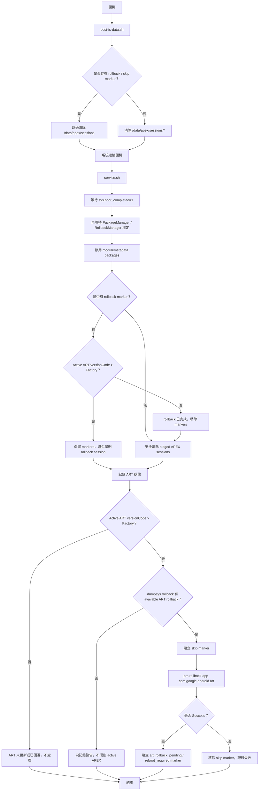

# Do Not ART Update

基於 [`dyrok/disable-gpsu-bootloops`](https://github.com/dyrok/disable-gpsu-bootloops) 修改的 Magisk / KernelSU / APatch 模組，用於降低 Google Play System Update（GPSU / Mainline APEX）自動更新 ART 導致 hook、Zygisk、Frida、runtime patch 失效的風險。

> ⚠️ 本模組屬於進階系統修改工具。請先確認你了解 APEX、ART、Rollback、Magisk 模組開機流程。錯誤操作可能造成 bootloop。

---

## 功能

本模組主要做以下幾件事：

1. 停用 Google Play System Update 的 metadata package：
   - `com.google.android.modulemetadata`
   - `com.google.android.overlay.modules.modulemetadata.forframework`

2. 清除尚未套用的 staged APEX sessions：

   ```text
   /data/apex/sessions/*
   ```

3. 偵測目前 ART 狀態：
   - Active ART versionCode
   - Factory ART versionCode
   - Active ART path
   - Factory ART path

4. 如果偵測到：

   ```text
   Active ART versionCode > Factory ART versionCode
   ```

   且系統存在可用 rollback，則執行：

   ```sh
   pm rollback-app com.google.android.art
   ```

5. 在 ART rollback pending 時，避免清除 `/data/apex/sessions/*`，防止 staged rollback 被誤刪。

6. 寫入 log，方便追蹤模組執行狀態。

---

## 不做的事

本模組**不會**做以下操作：

- 不停用 Play Store 的 Google Play 系統更新 UI。
- 不使用 `pm uninstall-system-updates`。
- 不直接刪除 `/data/apex/active`。
- 不直接刪除 `/system/apex`。
- 不自動重開機。
- 不保證所有 Android 版本與 ROM 都能成功阻止或回退 ART 更新。

---

## 為什麼不使用 `uninstall-system-updates`？

部分 Android 版本 / ROM 對 ART APEX 執行以下指令時會出現 PackageManager 例外：

```sh
pm uninstall-system-updates com.android.art
pm uninstall-system-updates com.google.android.art
cmd package uninstall-system-updates com.android.art
cmd package uninstall-system-updates com.google.android.art
```

可能錯誤：

```text
java.lang.NullPointerException:
Attempt to invoke virtual method
'boolean android.content.pm.ApplicationInfo.isUpdatedSystemApp()'
on a null object reference
```

因此本模組改用 Android 官方 rollback 流程：

```sh
pm rollback-app com.google.android.art
```

前提是系統保留了 available rollback。

---

## 支援狀況

| 狀況 | 結果 |
|---|---|
| 尚未更新 ART | 停用 metadata，清除 staged APEX sessions，降低後續自動更新風險 |
| 已下載但尚未重開套用的 APEX 更新 | 清除 `/data/apex/sessions/*`，阻止 staged update 套用 |
| ART 已更新，且存在 available rollback | 自動執行 `pm rollback-app com.google.android.art`，等待手動重開 |
| ART 已更新，但沒有 available rollback | 只記錄警告，不強制刪除 active APEX |
| Play Store GPSU UI 仍可打開 | 正常，本模組不處理 UI，只處理實際套用流程 |

---

## 重要路徑說明

| 路徑 | 說明 | 本模組是否處理 |
|---|---|---|
| `/system/apex` | ROM 內建 Factory APEX | 不刪除 |
| `/data/apex/sessions` | 已下載、等待下次重開套用的 staged APEX session | 會清除，但 rollback pending 時跳過 |
| `/data/apex/active` | 目前 active 的 APEX 更新版或 active copy | 不刪除 |
| `/apex` | 系統執行中掛載的 APEX | 不刪除 |

---

## 為什麼 `/data/apex/active` 不一定代表已更新？

rollback 後可能出現這種狀態：

```text
Active APEX packages:
    Path: /data/apex/active/com.android.art@331314010.apex
      versionCode=331314010

Factory APEX packages:
    Path: /system/apex/com.google.android.art.apex
      versionCode=331314010
```

雖然 Active path 仍在 `/data/apex/active`，但版本已經等於 Factory：

```text
Active versionCode == Factory versionCode
```

這種狀態視為 **factory-equivalent / safe**。

因此本模組不以路徑判斷是否已更新，而是以版本判斷：

```text
Active ART versionCode > Factory ART versionCode
```

只有 Active 版本高於 Factory 版本時，才視為 ART 已被更新。

---

## 模組結構

```text
disable-gpsu-art-guard/
├── module.prop
├── post-fs-data.sh
├── service.sh
└── uninstall.sh
```

---

## 開機流程



---

## 安裝方式

### 方式一：Magisk / KernelSU / APatch 安裝 ZIP

將模組打包成 ZIP 後，透過 Magisk / KernelSU / APatch 安裝，然後重開機。

### 方式二：手動放入模組目錄

假設模組目錄為：

```text
/data/adb/modules/disable-gpsu-art-guard
```

修正權限：

```sh
chmod 755 /data/adb/modules/disable-gpsu-art-guard/post-fs-data.sh
chmod 755 /data/adb/modules/disable-gpsu-art-guard/service.sh
chmod 755 /data/adb/modules/disable-gpsu-art-guard/uninstall.sh
chmod 644 /data/adb/modules/disable-gpsu-art-guard/module.prop
```

如果之前建立過停用標記，請移除：

```sh
rm -f /data/adb/modules/disable-gpsu-art-guard/disable
```

---

## 驗證指令

### 1. 確認 modulemetadata 是否停用

```sh
pm list packages --user 0 -d | grep modulemetadata
```

預期看到：

```text
package:com.google.android.modulemetadata
package:com.google.android.overlay.modules.modulemetadata.forframework
```

---

### 2. 確認 ART Active / Factory 版本

```sh
dumpsys package com.google.android.art \
  | grep -iE 'Active APEX packages|Inactive APEX packages|Factory APEX packages|Path:|versionCode|sourceDir'
```

安全狀態範例：

```text
Active APEX packages:
    Path: /data/apex/active/com.android.art@331314010.apex
      versionCode=331314010

Factory APEX packages:
    Path: /system/apex/com.google.android.art.apex
      versionCode=331314010
```

重點：

```text
Active versionCode == Factory versionCode
```

---

### 3. 確認是否有可用 rollback

```sh
dumpsys rollback | grep -iE 'art|rollback|staged|committed|available'
```

如果看到類似：

```text
-state: available
-isStaged: true
com.google.android.art 361501120 -> 331314010
```

代表可以透過：

```sh
pm rollback-app com.google.android.art
```

回退 ART。

---

### 4. 查看模組 log

```sh
cat /data/adb/modules/disable-gpsu-art-guard/gpsu_art_guard.log
```

---

## Marker 檔案說明

| 檔案 | 說明 |
|---|---|
| `skip_next_apex_session_clear` | 下次開機跳過清除 `/data/apex/sessions/*` |
| `art_rollback_pending` | ART rollback 已成功排程，等待重開機套用 |
| `art_update_detected` | 偵測到 Active ART 版本高於 Factory |
| `reboot_required_for_art_rollback` | ART rollback 已排程，需要手動重開機 |

---

## 常見狀況

### 1. Google Play 系統更新 UI 還能打開，正常嗎？

正常。

本模組不處理 Play Store UI，只處理 metadata package、staged APEX sessions 與 ART rollback。

UI 能打開不代表 ART 一定會成功更新。

---

### 2. `/data/apex/active` 還有 ART，是不是代表更新沒回退？

不一定。

請比較 versionCode：

```text
Active ART versionCode
Factory ART versionCode
```

如果兩者相同，視為已回到 factory-equivalent 狀態。

---

### 3. 沒有 available rollback 怎麼辦？

本模組不會硬刪 `/data/apex/active`。

如果沒有 rollback 記錄，常見選項只有：

- 保持目前版本
- Factory reset
- 重新刷完整 ROM / factory image
- 使用其他高風險手動方式，不建議寫進模組

---

### 4. 為什麼不直接刪 `/data/apex/active`？

因為 `/data/apex/active` 可能包含目前系統正在使用的 active APEX。

直接刪除 ART active APEX 有機率造成 bootloop。

---

## 安全原則

本模組遵守以下原則：

```text
可以清 /data/apex/sessions
可以停用 modulemetadata
可以使用 pm rollback-app
可以記錄 ART 狀態

不刪 /data/apex/active
不刪 /system/apex
不使用 uninstall-system-updates
不自動 reboot
不停用 Play Store UI
```

---

## 免責聲明

本模組無法保證所有裝置、所有 ROM、所有 Android 版本都能成功阻止 Google Play System Update 或回退 ART。

Google Play System Update、APEX、RollbackManager 的行為可能因 Android 版本、OEM ROM、Google Play services / Play Store 版本而異。

使用前請自行備份資料，並確保具備 recovery / fastboot / factory image 救援能力。

---

## Credits

- Original idea / base module: [`dyrok/disable-gpsu-bootloops`](https://github.com/dyrok/disable-gpsu-bootloops)
- Modified by: `lokey0905`
